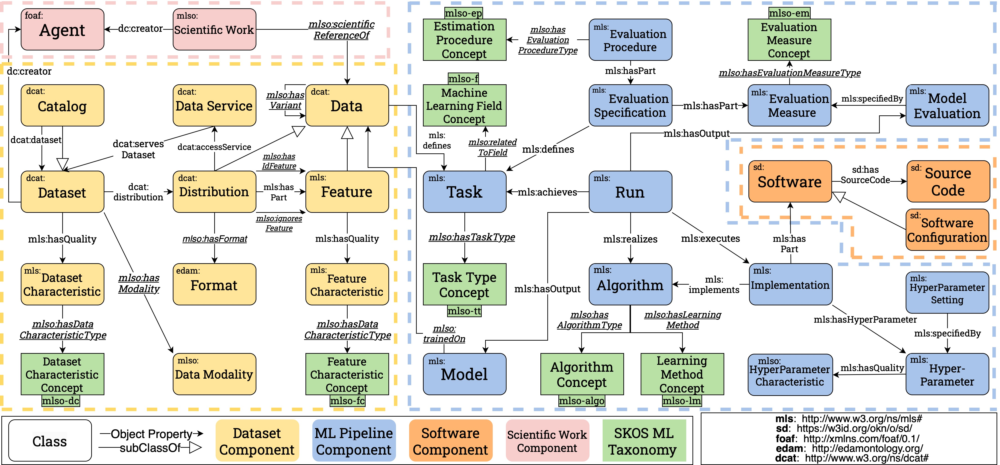

# MLSO

 

Available at: http://w3id.org/mlso  
  

# Scope of the Ontology and Quick Start

The Machine Learning Sailor Ontology (MLSO) and the Machine Learning Sailor Taxonomies (MLST) provide a flexible schema to represent ML pipelines, datasets, implementations and experiments. 

This repository contains the Turtle files and the documentation for the MLS ontology and taxonomies. 
MLSO is an ontology for describing machine learning datasets, tasks, pipelines, experiments, software and publications. The ontology extends ML-Schema, DCAT, FaBiO and SDO, complemented by 8 taxonomies formulated as controlled vocabularies.

Quick Start: Check out MLSO's [documentation](http://w3id.org/mlso), the Turtle files for the [ontology](https://github.com/dtai-kg/MLSO/blob/main/ontology/ml-onto.ttl) and the [taxonomies](https://github.com/dtai-kg/MLSO/tree/main/ontology/Taxonomies).

  

Core Entities and Relationships of MLSO:
  
  
  

MLSO and MLST Namespaces:

| Module | Description | Namespace |
|:---------:|:---------:|:---------:|
| MLSO | Machine Learning Sailor Ontology | http://w3id.org/mlso |
| MLSO-DC | Dataset Characteristic Taxonomy | http://w3id.org/mlso/vocab/dataset_characteristic |
| MLSO-FC | Feature Characteristic Taxonomy | http://w3id.org/mlso/vocab/feature_characteristic |
| MLSO-EM | Evaluation Measure Taxonomy | http://w3id.org/mlso/vocab/evaluation_measure |
| MLSO-EP | Estimation Procedure Taxonomy | http://w3id.org/mlso/vocab/estimation_procedure |
| MLSO-LM | Learning Method Taxonomy | http://w3id.org/mlso/vocab/learning_method |
| MLSO-ALGO | Algorithm Taxonomy | http://w3id.org/mlso/vocab/ml_algorithm |
| MLSO-F | Machine Learning Field Taxonomy | http://w3id.org/mlso/vocab/ml_field |
| MLSO-TT | Task Type Taxonomy | http://w3id.org/mlso/vocab/ml_task_type |

  

# Content negotiation at w3id.org

The ontology is published using GitHub pages. 
Content negotiation configuration on w3id.org is available [here](https://github.com/perma-id/w3id.org/tree/master/mlso).

  

# Cite 

Thank you for reading! To cite our resource:

    @InProceedings{dasoulas2024mlsea,
        author    = {Dasoulas, Ioannis and Yang, Duo and Dimou, Anastasia},
        booktitle = {The Semantic Web},
        title     = {{MLSea: A Semantic Layer for Discoverable Machine Learning}},
        year      = {2024}
    }

