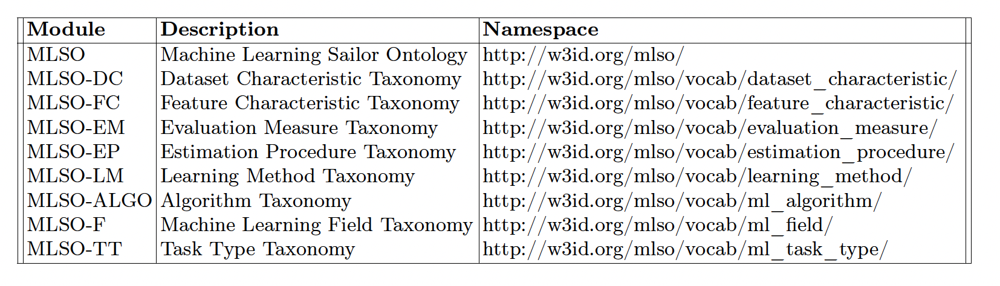

# MLSO

Available at: http://w3id.org/mlso  
  

# Scope of the Ontology and Quick Start

The Machine Learning Sailor Ontology (MLSO) and the Machine Learning Sailor Taxonomies (MLST) provide a flexible schema to represent ML pipelines, datasets, implementations and experiments. 

This repository contains the Turtle files and the documentation for the MLS ontology and taxonomies. 
MLSO is an ontology for describing machine learning datasets, tasks, pipelines, experiments, software and publications. The ontology extends ML-Schema, DCAT, FaBiO and SDO, complemented by 8 taxonomies formulated as controlled vocabularies.

Quick Start: Check out MLSO's [documentation](http://w3id.org/mlso), the Turtle files for the [ontology](https://github.com/dtai-kg/MLSO/blob/main/ontology/ml-onto.ttl) and the [taxonomies](https://github.com/dtai-kg/MLSO/tree/main/ontology/Taxonomies).

  

Core Entities and Relationships of MLSO:
  
  
  

Core Entities and Relationships of MLSO:

  

# Content negotiation at w3id.org

The ontology is published using GitHub pages. 
Content negotiation configuration on w3id.org is available [here](https://github.com/perma-id/w3id.org/tree/master/mlso).

